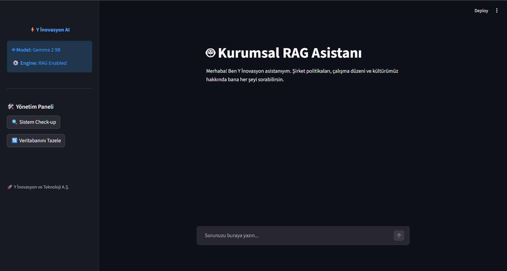
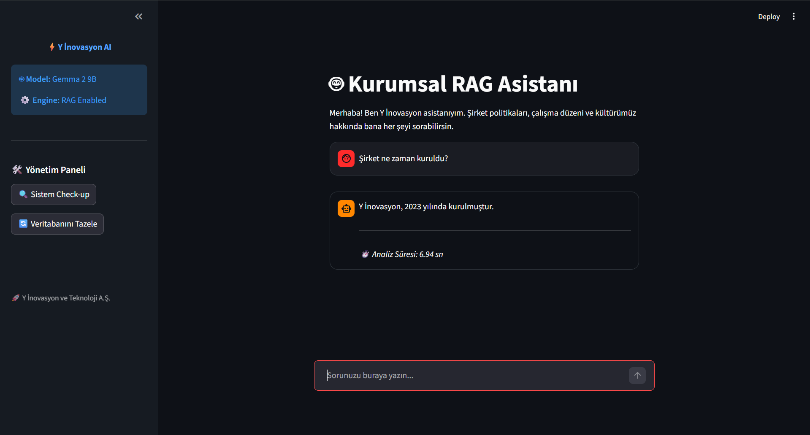
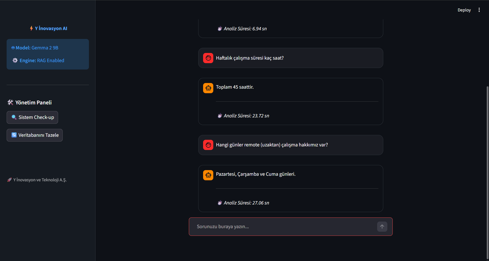
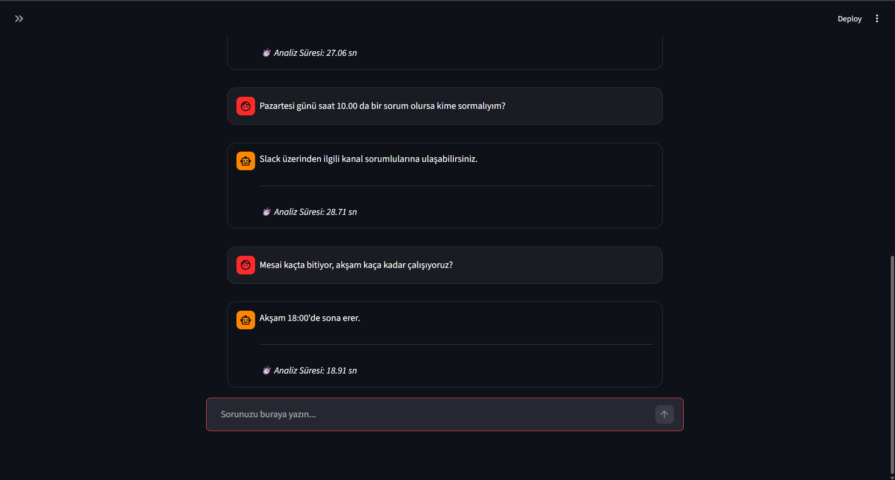
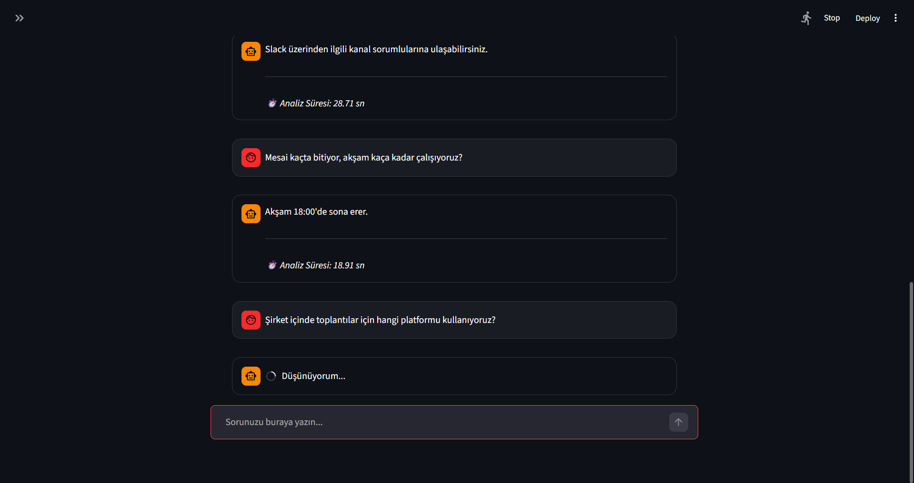
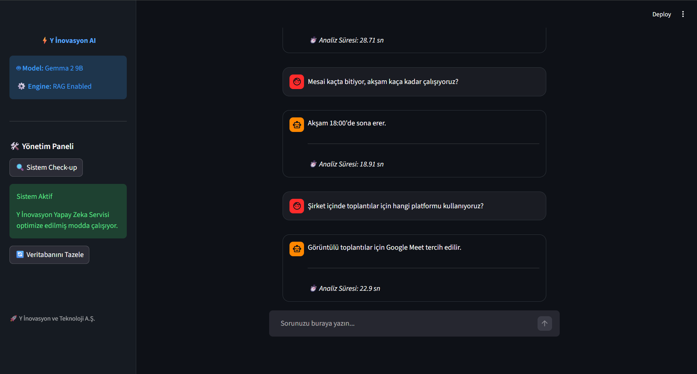

# 🚀 Kurumsal RAG Tabanlı Akıllı Soru-Cevap Asistanı

[](https://fastapi.tiangolo.com/)
[](https://streamlit.io/)
[](https://ollama.com/)
[](https://www.trychroma.com/)

**Y İnovasyon AI**, kurumsal verileri analiz eden, kullanıcı sorularını anlamsal olarak yanıtlayan ve tamamen yerel (**local**) kaynaklar üzerinde çalışan uçtan uca bir **Retrieval-Augmented Generation (RAG)** uygulamasıdır.

---

## 📝 1. Proje Özeti ve Problem Tanımı

Geleneksel chatbotlar, eğitildikleri verilerle sınırlıdır ve güncel kurumsal dokümanlar hakkında bilgi sahibi değildirler. Bulut tabanlı çözümler (OpenAI vb.) ise veri gizliliği açısından risk oluşturabilir. Kurumsal hafızanın korunması ve şirket içi bilgilere (çalışma düzeni, kültür, iletişim vb.) hızlı erişim, büyüyen ekipler için kritik bir ihtiyaçtır. Bu proje, verilerin gizliliğini korumak amacıyla tamamen yerel (local) kaynaklarda çalışan, halüsinasyon riskini minimize eden sistem talimatları sayesinde sadece verilen dokümana sadık cevaplar üreten, doküman dışı bilgi uydurmayan (anti-hallucination) bir asistan sunarak bu ihtiyacı karşılar.

---

## 📸 Uygulama Ekran Görüntüleri

   

   

---

## 🛠 2. Kullanılan Teknolojiler ve Tercih Nedenleri

**Gemma 2 9B (via Ollama)**: Google'ın açık kaynaklı modeli; yerel sistemlerde yüksek mantık yürütme kapasitesi ve kusursuz Türkçe desteği sunduğu için seçildi.

**ChromaDB**: Hafif, hızlı, persistent (kalıcı) yapısı sayesinde ve etkili anlamsal arama (cosine similarity) yetenekleri sunduğu için milyonlarca vektörü düşük gecikmeyle arayabildiği için tercih edildi.

**FastAPI**: Hızlı, asenkron, modern bir REST API altyapısı sağlamak için ve düşük kaynak tüketimi ile model cevap üretirken sistemin kilitlenmesini önlediği için seçildi.

**Streamlit**: Teknik olmayan kullanıcıların da yapay zeka ile etkileşime girmesini sağlayan, kullanıcı dostu, modern bir UX/UI sunduğu için tercih edilmiştir.

---

## 📐 3. Sistem Mimarisi

Sistem, veriyi ham metinden anlamlı bir cevaba dönüştürmek için 4 aşamalı bir boru hattı (**pipeline**) kullanır:

**Ingestion (Veri Besleme)**: data/sirket_bilgileri.txt dosyası, anlamsal bütünlüğü koruyacak şekilde akıllı parçalara (chunking) ayrılır.

**Vectorization (Vektörleştirme)**: Her bir metin parçası, ChromaDB üzerinde Cosine Similarity (Açısal Benzerlik) metriği ile koordinatlandırılır.

**Context-Aware Retrieval**: Kullanıcı bir soru sorduğunda, sistem veritabanından sorunun "anlamına" en yakın 4 adet bilgi parçasını cımbızla çeker.

**Guardrailed Generation**: Seçilen bilgiler ve kullanıcı sorusu, önceden kurgulanmış "Sistem Talimatları" ile birleştirilerek Gemma 2'ye iletilir. Model, döküman dışına çıkmadan profesyonel bir cevap üretir.

---

## ⚡ 4. Mühendislik Zorlukları ve Optimizasyonlar

Geliştirme sürecinde donanım sınırları (**16GB RAM**) bir engel değil, bir tasarım kriteri olarak ele alınmıştır:

- **RAM Yönetimi**: Modelin %90 RAM kullanımı altında stabil kalması için LLM parametreleri (`temperature: 0.0`, `num_ctx: 4096`) optimize edildi.
- **Query Expansion Optimizasyonu**: İlk aşamada kullanılan "Sorgu Genişletme" katmanı, donanım kaynaklarını aşırı tüketip yanıt süresini 60 saniyenin üzerine çıkardığı için sistemden arındırılarak doğrudan RAG akışına geçilmiştir. Bu sayede analiz süresi **%50 oranında** iyileştirilmiştir.
- **Timeout Stratejisi**: Yerel CPU kullanımı nedeniyle geciken yanıtları yönetmek için frontend-backend arasındaki zaman aşımı süresi **120 saniyeye** çıkarılarak sistem kararlılığı sağlanmıştır.

---

## 🚀 5. Kurulum ve Çalıştırma

### Ön Hazırlık

**1.Ollama Kurulumu:** [Ollama.com](https://ollama.com) üzerinden uygulamayı indirin.

**2.Modeli İndirin:** Terminale şu komutu yazın:

```bash
   ollama run gemma2:9b
```

### Uygulamanın Başlatılması

**1.Sanal Ortamı Oluşturun ve Aktif Edin:**

```bash
    python -m venv venv
    .\venv\Scripts\activate
```

**2.Kütüphaneleri Yükleyin:**

```bash
    pip install -r requirements.txt
```

**3.Backend'i (API) Çalıştırın:**

```bash
    uvicorn app.main:app --reload
```

**4.Frontend'i (Streamlit) Çalıştırın:**

```bash
    streamlit run gui.py
```

---

## 🧪 6. Test ve Hata Yönetimi

Proje, yazılım kalitesini ve sistem güvenilirliğini en üst düzeyde tutmak amacıyla kapsamlı birim testleri (**unit tests**) ile desteklenmiştir.
Kod kalitesini ve API uç noktalarının (endpoints) doğruluğunu denetlemek için **pytest** framework'ü tercih edilmiştir.

### 🔍 Test Kapsamı

- **Endpoint Doğrulama:** `/health` ve `/index` uç noktalarının servis durumu ve veri senkronizasyon başarısı test edilmektedir.
- **Giriş Validasyonu (Input Handling):** Boş sorgular veya 3 karakterden kısa (min_length=3) girişlerin API seviyesinde (422 Unprocessable Entity) yakalandığı ve kullanıcıya anlamlı hata mesajları döndüğü doğrulanmıştır.
- **Sistem Entegrasyonu:** LLM servisinin yanıt verme kapasitesi ve metadata yapısının tutarlılığı simüle edilerek denetlenmektedir.

### 🛠️ Testleri Çalıştırma

```bash
    pytest tests/test_api.py
```

---

## 📂 7. Klasör Yapısı

Proje, sürdürülebilir geliştirme (maintainability) ve kod okunabilirliği prensiplerine uygun olarak modüler bir klasör hiyerarşisiyle yapılandırılmıştır:

```text
├── app/                  # Backend ve Servis Katmanı
│   ├── main.py           # API Gateway ve Route Tanımlamaları (FastAPI)
│   ├── llm_service.py    # LLM (Gemma 2) İletişim ve Parametre Yönetimi
│   ├── rag_engine.py     # Vektör Veritabanı (ChromaDB) ve Arama Mantığı
│   └── gui.py            # Streamlit Tabanlı Kullanıcı Arayüzü (Frontend)
├── data/                 # Veri Kaynakları
│   └── sirket_bilgileri.txt # Sistemin beslendiği kurumsal bilgi dökümanı
├── tests/                # Kalite Güvence ve Test Katmanı
│   └── test_api.py       # Birim testleri (Pytest)
├── chroma_db/            # Vektör Veritabanı Saklama Alanı (Persistent)
├── requirements.txt      # Proje Bağımlılıkları ve Kütüphane Listesi
└── README.md             # Teknik Proje Dökümantasyonu
```

---

## 🌟 Son Söz

Bu proje, yerel imkanlarla neler başarılabileceğini görmeye çalıştığım bir mühendislik yolculuğuydu. Donanım limitlerini zorladığım (özellikle o %90 RAM kullanımı! 😅), her bir satır kodda mantıklı bir akış kurmaya çalıştığım bu süreçte; sistemin karmaşık sorulara dokümanlara sadık kalarak doğru yanıtlar vermesi en büyük motivasyonumdu.

Vaktinizi ayırıp projemi incelediğiniz için teşekkür ederim. Gelecekte bu asistanı daha hızlı ve daha zeki hale getirmek için sabırsızlanıyorum!

**Geliştiren:** *Melike Dönmez*

*Y İnovasyon AI - Kurumsal Hafızanın Yeni Yüzü* 🚀


---
